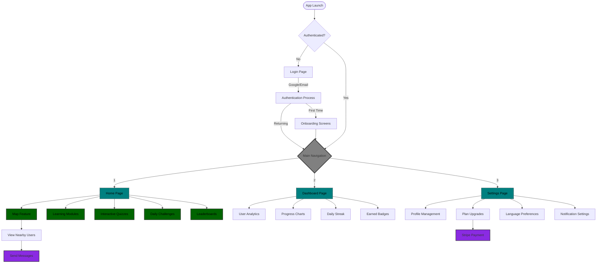

# Welcome to OpenLearn 👋

This is an Expo project created with `create-expo-app`.

## Get started

1. Clone this project:

   ```
   git clone https://github.com/SIAM-TheLegend/OpenLearn.git
   ```

2. Install dependencies

   ```
   npx expo install
   ```

3. Start the app

   ```
    npx expo start
   ```

You can start developing by editing the files inside the **app** directory. This project uses [file-based routing](https://docs.expo.dev/router/introduction).

## Frameworks and Libraries used here:

==> TailwindCSS  
==> Nativewind  
==> React Native Reanimated

## Project Structure

```
📦OpenLearn/
├── 📂 app/
│   ├── 📂 (auth)/
│   │   ├── 📄 login.js
│   │   ├── 📄 register.js
│   │   └── 📄 forgot-password.js
│   ├── 📂 (tabs)/
│   │   ├── 📄 _layout.js
│   │   ├── 📄 index.js
│   │   ├── 📄 dashboard.js
│   │   └── 📄 settings.js
│   ├── 📂 lessons/
│   │   ├── 📄 [id].js
│   │   └── 📄 index.js
│   ├── 📂 map/
│   │   └── 📄 index.js
│   ├── 📂 chat/
│   │   ├── 📄 [userId].js
│   │   └── 📄 index.js
│   └── 📄 _layout.js
│
├── 📂 components/
│   ├── 📂 auth/
│   │   ├── 📄 AuthProvider.js
│   │   └── 📄 useAuth.js
│   ├── 📂 lessons/
│   │   ├── 📄 LessonCard.js
│   │   ├── 📄 Quiz.js
│   │   └── 📄 Progress.js
│   ├── 📂 map/
│   │   ├── 📄 UserMarker.js
│   │   └── 📄 NearbyUsers.js
│   ├── 📂 dashboard/
│   │   ├── 📄 ProgressChart.js
│   │   ├── 📄 ActivityFeed.js
│   │   └── 📄 Achievements.js
│   └── 📂 common/
│       ├── 📄 Button.js
│       ├── 📄 Card.js
│       └── 📄 Loading.js
│
├── 📂 constants/
│   ├── 📄 Colors.js
│   ├── 📄 Layout.js
│   └── 📄 Config.js
│
├── 📂 services/
│   ├── 📄 api.js
│   ├── 📄 auth.js
│   ├── 📄 firebase.js
│   ├── 📄 location.js
│   ├── 📄 stripe.js
│   └── 📄 socket.js
│
├── 📂 hooks/
│   ├── 📄 useLocation.js
│   ├── 📄 useNearbyUsers.js
│   └── 📄 useUserProgress.js
│
├── 📂 context/
│   ├── 📄 AuthContext.js
│   └── 📄 ProgressContext.js
│
├── 📂 assets/
│   ├── 📂 images/
│   ├── 📂 animations/
│   └── 📂 fonts/
│
├── 📄 app.json
├── 📄 metro.config.js
├── 📄 package.json
├── 📄 package-lock.json
├── 📄 tailwind.config.js
└── 📄 tsconfig.json
```

## Key Features & Implementation Details

### Authentication Flow

- Uses Firebase Authentication
- Implements OAuth (Google, Facebook)
- Secure token storage with expo-secure-store
- Protected routes using expo-router

### Home Screen Features

```javascript
// app/(tabs)/index.js features
- Daily Challenges
- Progress Overview
- Quick Practice Sessions
- Vocabulary Lists
- Grammar Exercises
- Speaking Practice
- Writing Exercises
- Community Events
```

### Map Implementation

```javascript
// app/map/index.js features
- Real-time user location tracking
- Nearby learners discovery
- User filtering by language level
- Direct chat initiation
- Community events on map
- Study group formation
```

### Dashboard Analytics

```javascript
// app/(tabs)/dashboard.js features
- Learning streak
- Weekly/monthly progress
- Vocabulary mastery
- Grammar accuracy
- Speaking confidence score
- Writing progress
- Community engagement metrics
- Achievements and badges
```

### Settings & Premium Features

```javascript
// app/(tabs)/settings.js features
- User profile management
- Language level settings
- Study preferences
- Notification settings
- Premium plan upgrade (Stripe)
- Download management
- Privacy settings
- App appearance
```

### Real-time Features

- Socket.IO for chat functionality
- Firebase Real-time Database for user locations
- Push notifications for:
  - Nearby learner alerts
  - Daily streak reminders
  - Community event invitations
  - Achievement unlocks

### Data Models

```javascript
// User Model
{
  id: string,
  name: string,
  email: string,
  languageLevel: string,
  location: {
    latitude: number,
    longitude: number
  },
  progress: {
    streak: number,
    xp: number,
    level: number
  },
  premium: boolean,
  achievements: Array,
  settings: Object
}

// Lesson Model
{
  id: string,
  title: string,
  type: string,
  difficulty: string,
  content: Object,
  xpReward: number
}

// Chat Model
{
  id: string,
  participants: Array,
  messages: Array,
  createdAt: timestamp
}
```

# Visual Structure


